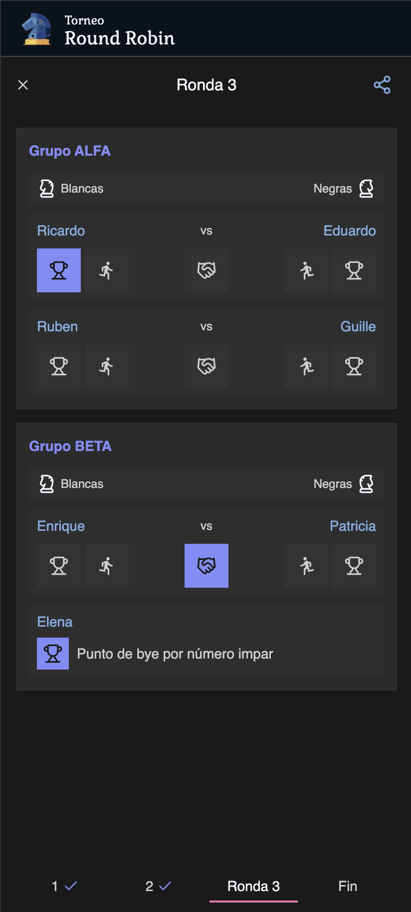
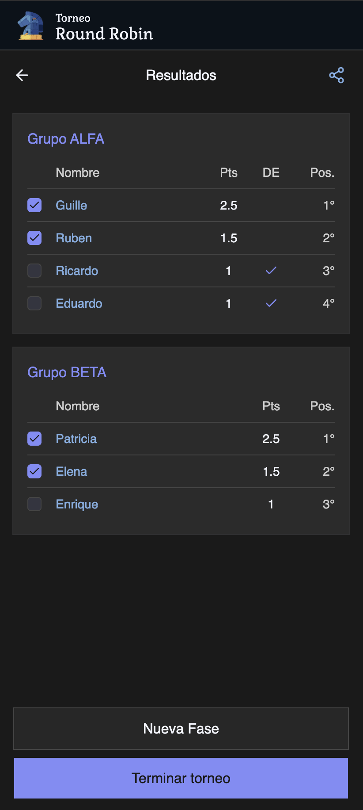
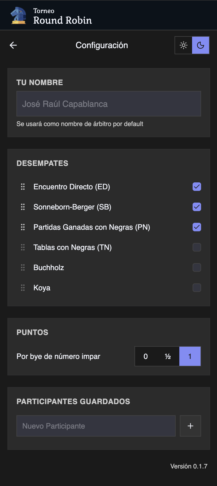

# Chess Round Robin

[](https://app.netlify.com/projects/chessroundrobin/deploys)

A mobile-first PWA for chess clubs to manage their informal round-robin tournaments. Built with Claude Code.

## What it does

Chess Round Robin helps club arbitrators run round-robin tournaments without paperwork. You enter the participants, the app builds groups and rounds automatically, you record results match by match, and it calculates standings with tiebreaks in real time. Completed tournaments are saved to history for future reference.

Key features:

- **Automatic fixture generation** using the Berger circle method
- **Group management** — distributes participants into balanced groups
- **Live standings** with configurable tiebreak rules — defaults to Direct Encounter and Win with Black pieces
- **Offline-ready PWA** — installable on mobile, works without internet
- **Configurable scoring** — set custom points for forfeits and byes
- **Tournament history** — completed tournaments are persisted locally, so you can use the app offline
- **White-label support** — easily customize branding for different clubs using environment variables
- **PWA features** — installable as an app on mobile devices

## Demo screenshots

### Round view



### Results view



### Settings view



## Tech stack

- React + TypeScript + Vite
- Tailwind CSS + shadcn/ui
- Zustand (state management)
- Vitest (unit tests)
- Pure domain logic — all business rules are framework-free functions in `src/domain/`

## Installation

### Prerequisites

- [Node.js](https://nodejs.org/) v22 (see `.nvmrc`). If you use nvm: `nvm use`
- npm (comes with Node.js)

### Setup

1. Clone the repository:

```bash
git clone https://github.com/libasoles/chess-round-robin.git
cd chess-round-robin
```

1. Install dependencies:

```bash
npm install
```

1. Start the development server:

```bash
npm run dev
```

The app will be available at `http://localhost:5173`.

## White-Label Branding (Marca Blanca)

This project supports multiple brands using `VITE_BRAND`.

### Default brand on `main`

`main` must run with default assets from `public/`:

- `logo.png`
- `favicon.png` / `favicon.ico`
- `pwa-192x192.png` / `pwa-512x512.png`
- `empty.png`

Current default config:

```env
VITE_BRAND=default
```

When `VITE_BRAND` is `default` (or unset), the app uses root assets (`/public/*`).

### Add a new brand

1. Create `public/brand/<brand>/` with:
   `logo.png`, `favicon.png`, `favicon.ico`, `pwa-192x192.png`, `pwa-512x512.png`, `empty.png`.
2. Add brand labels in [`src/lib/brand.ts`](/Users/guillermoperez/Projects/playground/chess-round-robin/src/lib/brand.ts) (`brandNames`, `brandTopLabels`, `brandAltText`).
3. Set environment variables for that deployment:
   `VITE_BRAND`, `VITE_BRAND_NAME`, `VITE_BRAND_URL`, `VITE_BRAND_OG_IMAGE`, `VITE_BRAND_DESCRIPTION`.

Notes:

- `vite.config.ts` rewrites favicon/touch icon paths automatically for non-default brands.
- `index.html` uses `%VITE_*%` placeholders for metadata.

## Available commands

```bash
npm run dev        # start dev server
npm run build      # type check + production build
npm run preview    # preview the production build locally
npm run lint       # ESLint
npm test           # run all tests once
npm run test:watch # run tests in watch mode
npm run coverage   # coverage report for domain and lib
```

## Running a single test

```bash
npx vitest run src/domain/__tests__/groupSizes.test.ts

# or by name pattern:
npx vitest run --reporter=verbose -t "bergerTable"
```

## React Compiler

The React Compiler is enabled on this template. See [this documentation](https://react.dev/learn/react-compiler) for more information.

Note: This will impact Vite dev & build performances.

## Expanding the ESLint configuration

If you are developing a production application, we recommend updating the configuration to enable type-aware lint rules:

```js
export default defineConfig([
  globalIgnores(["dist"]),
  {
    files: ["**/*.{ts,tsx}"],
    extends: [
      // Other configs...

      // Remove tseslint.configs.recommended and replace with this
      tseslint.configs.recommendedTypeChecked,
      // Alternatively, use this for stricter rules
      tseslint.configs.strictTypeChecked,
      // Optionally, add this for stylistic rules
      tseslint.configs.stylisticTypeChecked,

      // Other configs...
    ],
    languageOptions: {
      parserOptions: {
        project: ["./tsconfig.node.json", "./tsconfig.app.json"],
        tsconfigRootDir: import.meta.dirname,
      },
      // other options...
    },
  },
]);
```

You can also install [eslint-plugin-react-x](https://github.com/Rel1cx/eslint-react/tree/main/packages/plugins/eslint-plugin-react-x) and [eslint-plugin-react-dom](https://github.com/Rel1cx/eslint-react/tree/main/packages/plugins/eslint-plugin-react-dom) for React-specific lint rules:

```js
// eslint.config.js
import reactX from "eslint-plugin-react-x";
import reactDom from "eslint-plugin-react-dom";

export default defineConfig([
  globalIgnores(["dist"]),
  {
    files: ["**/*.{ts,tsx}"],
    extends: [
      // Other configs...
      // Enable lint rules for React
      reactX.configs["recommended-typescript"],
      // Enable lint rules for React DOM
      reactDom.configs.recommended,
    ],
    languageOptions: {
      parserOptions: {
        project: ["./tsconfig.node.json", "./tsconfig.app.json"],
        tsconfigRootDir: import.meta.dirname,
      },
      // other options...
    },
  },
]);
```
